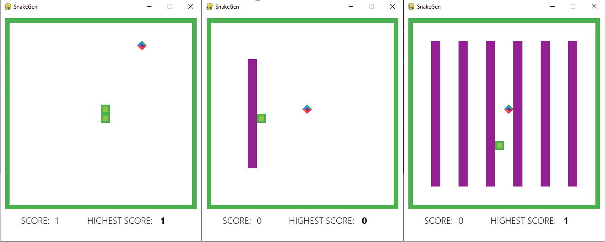

# Snake Bot
This project aims conduct experiments with different approaches toward solving the popular 2D
”Snake” game in the following modes:
   
    1. Standard
    2. With a wall placed on the playground
    3. With a maze
The algorithms implemented as part of this project are:
   
    1. Deep Q-Learning with Prioritized Experience Replay
    2. Double Deep Q-Networks with periodic update
    3. Dueling Deep Q-Networks

## Prerequisites

Use the following command to install all necessary dependencies:
```
pip install -r requirements.txt
```

## Installation

Run project with the following command:
```
python main.py {--algorithm=agent_type} {--mode=mode} {--graphics/--no-graphics} {--weights-path=path_to_weights}
```

Command parameters:

    1. --algorithm - optional parameter which has three possible values: experience_replay_dqn, double_dqn, dueling_dqn
    2. --mode - optional parameter with three possible values: standard, wall, maze
    3. --graphics/--no-graphics - optional parameter with default value True; show/not show game space
    4. --weights-path - pass the path to a '*.hdf5' file with the network weights from a previous training 
                        to use a pretrained model; the path must lead to a file corresponding to 
                        the selected agent type.

Example commands:

```python main.py``` - run project with default agent: DuelingDQNAgent, graphics and standard mode without using previously trained weights.

```
python main.py --algorithm=dueling_dqn mode=wall --no-graphics
```
```
python main.py --algorithm=double_dqn mode=standard --no-graphics
```
```
python main.py --algorithm=experience_replay_dqn mode=maze --graphics
```


